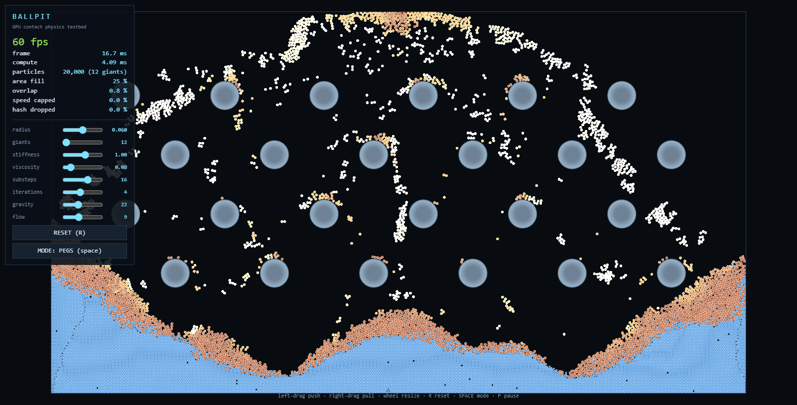
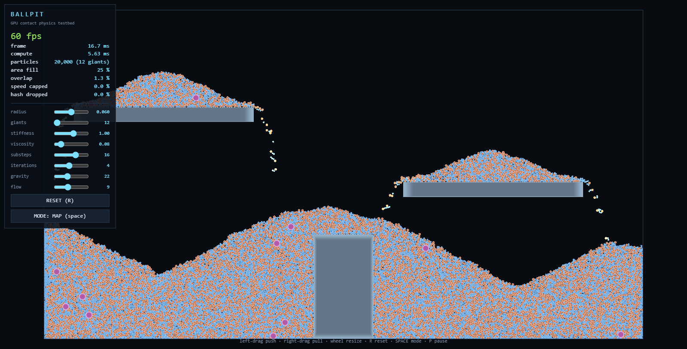
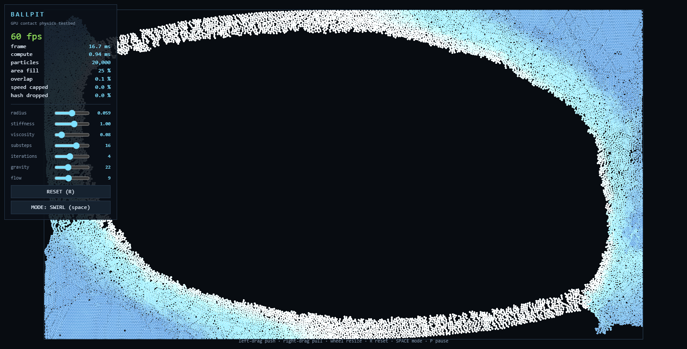

# BALLPIT

GPU contact physics testbed. 20,000 particles, WebGPU compute via three.js TSL,
no build step. One file of simulation, one file of test rig.

**Live: [tront.xyz/ballpit](https://tront.xyz/ballpit/)** (needs WebGPU: Chrome, Edge, or Firefox 141+)

    node serve.mjs 8100          # then open http://localhost:8100/
    node tools/probe.mjs         # drives real Chrome, judges the physics, exits nonzero on failure
    node tools/eval.mjs "<expr>" # ad-hoc: run any expression against a live sim
    node tools/og.mjs            # re-shoots og-image.png from a live dam break

`?n=50000` changes the head count; the radius follows from it automatically.
`?giants=10000` sets the boot giant count and sizes the grids for it.

## What it is for

To settle one question away from any game code: can a crowd of particles flow,
collide and pack like a liquid entirely on the GPU. Four modes, each of which
fails visibly if the solver is wrong:

| mode | what it proves |
|------|----------------|
| **DAM BREAK** | a released column collapses into a spreading wave with a thin front. The standard fluid validation case. |
| **FALL** | a dropped slab settles into a heap **and stops**. Tests resting contact. |
| **RIVER** | a sideways body force banks the mass up against the far wall. |
| **SWIRL** | a rotating force keeps the whole mass in motion instead of jamming. |
| **PEGS** | a timed pour through static obstacles. Tests the spawn schedule and obstacle collision at once. |
| **SHOVE** | a mixed-size crowd driven sideways into a packed wedge. Tests banking and the cross-tier guarantees under sustained crush. |
| **MAP** | a slab dropped onto solid rectangles: two shelves and a pillar. Tests that balls pile up ON static boxes and never end up inside one. |

Left-drag pushes, right-drag pulls, the wheel resizes the tool. Pull is the more
interesting one: a solver that cannot hold a void open collapses the instant you
let go.

## Map collision

Solid rectangles the balls cannot enter, resolved like the pegs: an immovable
body is a contact with zero inverse mass, so the ball takes the whole
correction. Projected after the particle-particle pass and before the walls. A
ball whose centre is outside the rectangle is pushed away from its closest point
on the surface, which rounds the corners correctly; a centre that somehow ends
up inside exits through the nearest face.

MAP mode ships a default layout (two shelves and a pillar). Any layout can be
set live, up to 16 boxes, each `[cx, cy, width, height]`:

    __ballpitSet('boxes', [[20, 3.5, 4, 7], [8, 15, 12, 1]])

Boxes survive R resets but are cleared on a mode change. The probe counts any
ball whose centre ends a run inside a rectangle (`boxOverlaps`) and fails the
run if it is not zero; tunnelling through a static body is silent otherwise.

## Sizes and masses

Three classes share one solver: small balls (0.85x) and large balls (1.2x) make
up the crowd, giants (3.5x) are the rare heavies. Mass follows area, so a giant
carries ~17x the mass of a small, and the inverse-mass split in the contact
solve does the rest; there is no other mass code.

The broad phase is TWO hash grids, one per tier. The crowd lives in a fine
grid, giants in a coarse giants-only grid, and every ball is listed in exactly
one, so no pair can be found twice. All four pair types are still discovered:
crowd-crowd in the fine grid 3x3 as always, crowd-giant through the coarse 3x3
(one coarse cell out-reaches the pair), giant-crowd through a wider fine window
(a giant genuinely touches that many more neighbours, so it pays
proportionally), giant-giant through the coarse 3x3. A single grid would tax
every small ball with giant-sized cells forever; multi-cell scatter would buy
duplicate contacts. Two grids dodge both.

The giant count is a live slider from zero to the full head count: class
boundaries are uniforms compared against the particle index, so changing the
count is a reset, not a reallocation. The fill compensates automatically (more
giants, smaller everyone). For serious giant battles set `?giants=` at boot so
both grids are allocated for the mix; the slider still works far above the boot
count, it just starts reporting honest neighbour drops in `hash dropped %`.

## The rule

**Contacts own position. Velocity is derived from position, never assigned.**

Steering may only propose a motion during the prediction step. The contact
solver then overrules it freely, and the velocity that comes out is whatever the
particle actually managed to move:

    v = (p - p_before) / h

That one line is what lets a pile support itself. There is no damping term, no
friction hack and no special case for "resting": a particle that could not move
has no velocity, automatically.

Do the opposite and assign a target velocity each frame, and a particle crushed
at the bottom of a pile is still told it is moving at full speed. Contacts can
never win, the pile compresses forever, and you get a pancake on the floor.

## The loop

    for each substep (h = dt / substeps):
      clear     zero the hash and the counters
      predict   v += accel * h;  clamp travel;  prev = p;  p += v * h
      scatter   every particle claims a slot in its grid cell
      relax  xK read neighbours, write a positional correction   (Jacobi)
      apply  xK add the correction, clamp to the walls
      finish    v = (p - prev) / h, then XSPH viscosity

`relax` and `apply` are separate dispatches on purpose. Reading neighbour
positions out of the same buffer you are writing is a data race: every particle
would see a different mix of old and new neighbours depending on scheduling.

## Findings

**Substeps beat iterations, and it is not close.** Residual overlap on a settled
pile of 20,000, as a share of a particle diameter:

| | 2 iterations | 4 iterations | 8 iterations |
|---|---|---|---|
| **4 substeps** | 48% | | |
| **8 substeps** | 31% | 20% | 8.3% |
| **16 substeps** | 6.6% | **1.9%** | |

Doubling substeps beat quadrupling iterations every time. Iterations only polish
what the substep already saw; they cannot recover a contact the particle stepped
straight over. Default is 16 x 4, which costs about 0.9 ms of compute.

**Tunnelling is the whole ball game.** At gravity 22 a particle reaches ~34
units/s. At `h = 1/120` that is 0.167 units of travel per substep against a
radius of 0.0485, three and a half radii, so it steps clean through the layer
below before a contact is ever detected. Hence the hard travel cap of about one
radius per substep, and hence `speed capped %` on the panel: if that number is
large, the substep count is too low for the gravity in use.

**Then the hash lies.** Once a pancake forms, one 0.1-unit cell holds ~80
particles and `BUCKET_K` records twelve. Ninety percent of neighbours become
invisible and the pile can never recover, so the drop is counted and shown as
`hash dropped %`. A silent drop here is indistinguishable from good physics right
up until the crowd interpenetrates.

**Radius must be derived from the head count, not chosen.** Asking 40,000 balls
of radius 0.18 to live in a 60x34 box is asking them to occupy 200% of the
available area. No solver can satisfy that, and the failure looks exactly like
the flat pancake it is. Radius is now solved for a target area fill, and the
fill is on the panel.

**Average the correction, do not sum it.** A particle with eight neighbours
pushing on it must move once, not eight times. Summing makes a packed crowd
explode, and the clamp people bolt on afterwards is what makes it lock solid.

**XSPH viscosity is the difference between marbles and water.** It nudges each
particle toward its neighbourhood's average velocity. Because it is velocity
*smoothing* rather than assignment, it still cannot overrule a contact.

**Non-penetration constraints are weightless, so there is no buoyancy.** SHOVE
began as a two-density buoyancy test and that test failed twice, which was worth
more than a pass. A well-mixed box did not segregate at all (0.04 units in 14
seconds), and a dense layer stacked on top of a light one sat there quite
happily instead of sinking. The reason: gravity here is an *acceleration*, so a
heavy particle never presses down harder; it only resists being pushed. A
settled pack also sits under 1% overlap, so corrections are tiny and the mass
difference has nothing to bite on; it is a solid, not a liquid, which is why real
granular beds need shaking to segregate. Buoyancy needs a density constraint
(position based *fluids*), a different solver rather than a tweak to this one.

**Same-size mass makes heavy things trail, not lead.** What inverse mass buys
is resistance to displacement. In a driven crowd the phase that takes the
*larger* share of every correction is the one squirted up and over the free
surface, so light particles surf forward while heavy ones stay in the packed
body (measured with the old same-size 5x-mass split, repeatable in sign).
Worth knowing before designing a crowd game around heavy units battering to
the front: mass alone will not do it, they need different steering authority.

**But size beats mass: the Brazil nut effect is real and needs agitation.**
Once mass was tied to area, the giants (17x the mass of a small) stopped
sinking and started RISING. Shake a mixed granular bed and every jiggle opens
voids under a big body that only small bodies can backfill, so the big ones
ratchet upward regardless of weight, exactly like the big nuts in the jar. The
textbook condition reproduces too: in SWIRL, which never stops churning, 300
giants ride measurably above the crowd and the probe asserts the gap; in
SHOVE, where the crowd freezes into a wedge, segregation stops exactly where
the motion died. The crowd's own 2x contrast (large vs small) sits below the
noise floor entirely.

## Panel

Everything is live except the head count. The three numbers that matter are
diagnostics, not decoration:

- **overlap**: mean deepest interpenetration as a share of a diameter. Under
  ~3% is rigid. Over 12% turns red: the solver is not converging.
- **speed capped**: share of particles hitting the travel limit. Should be 0.
- **hash dropped**: share of particles the grid could not record. Should be 0.

## Test rig

`tools/probe.mjs` boots a real Chrome over CDP (headless WebGPU is unreliable),
runs each mode, reads the particle buffer back and asserts on the *shape* of the
result: how far the front travelled, whether the surface slopes the right way,
whether the pile actually came to rest. It prints a height profile as a
sparkline, so a broken run is legible in one line of terminal output:

    surface |###**++==--::..        .|   <- dam break, correct
    surface |@                      %|   <- everything piled at both walls, broken

"At rest" is measured as position drift over 1.2 s, not as velocity: velocity is
displacement over a substep of ~1 ms, so a jiggle of a hundredth of a radius
reads as half a unit per second and would condemn a pile that is visually stone
still.

Every run writes two copies of each shot: a stable `shots/<mode>.png` for the
README and the landing page, and a dated copy under `shots/archive/` that is
never overwritten. The archive is the visual history of the solver; it is how
you spot a regression as a picture rather than as a number.

Chrome is launched with occlusion detection disabled. Without those flags it
stops `requestAnimationFrame` the moment anything covers the window: zero frames,
no error, and a run that looks like a hang. The rig opens its own tab and kills
only its own throwaway profile.
